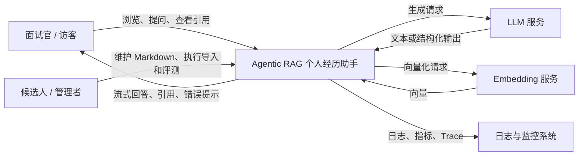
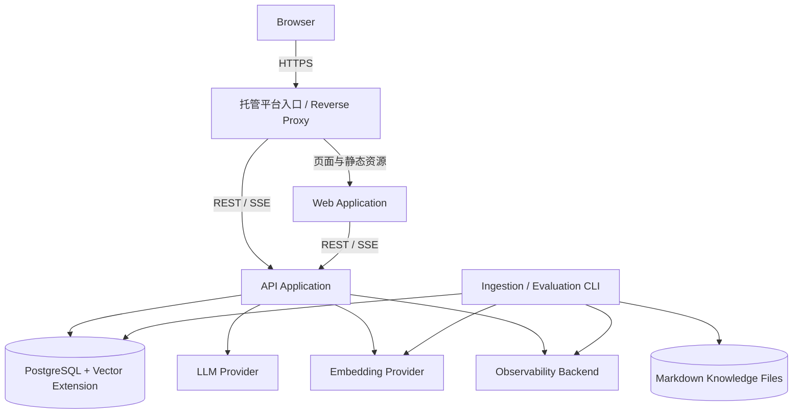
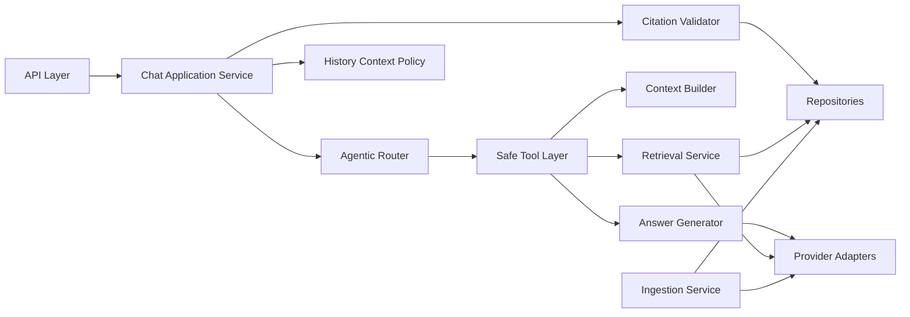
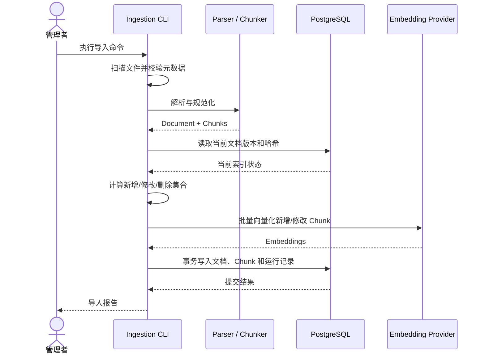
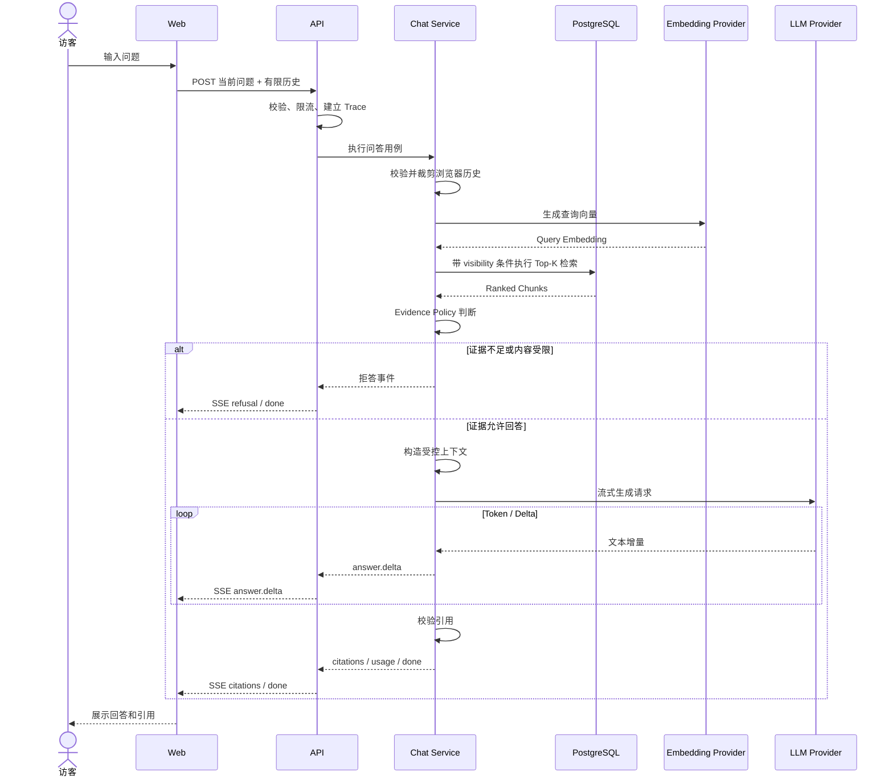
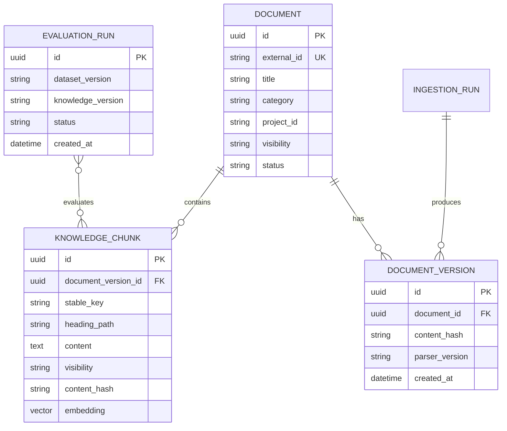
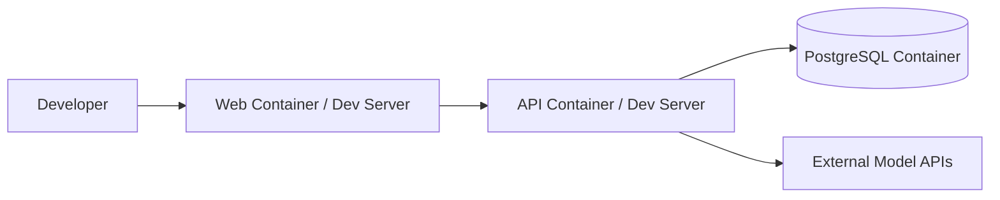
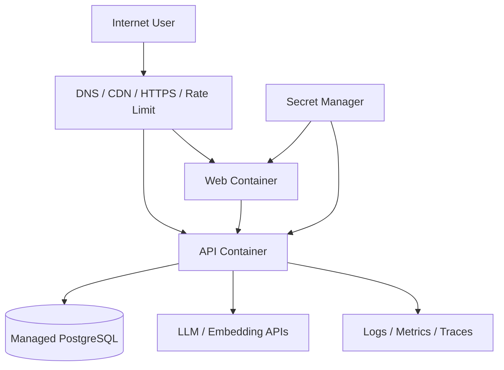

# Agentic RAG 个人经历助手系统架构设计

## 1. 文档信息

| 项目 | 内容 |
| --- | --- |
| 产品名称 | Agentic RAG 个人经历助手（暂定） |
| 文档版本 | v0.5 |
| 文档状态 | Agentic RAG 作品集项目架构草案 |
| 关联文档 | [PRD](./PRD.md) |
| 目标读者 | 开发者、架构评审者、测试者、运维人员 |
| 更新时间 | 2026-07-17 |

### 1.1 版本记录

| 版本 | 日期 | 变更内容 |
| --- | --- | --- |
| v0.1 | 2026-07-15 | 建立 MVP 系统边界、组件职责、核心数据流、数据模型、安全与部署基线 |
| v0.2 | 2026-07-15 | 按个人作品集定位简化会话持久化、反馈、知识权限和企业级运维要求 |
| v0.3 | 2026-07-17 | 修正架构主线：个人经历是应用场景，核心架构目标是 Agentic RAG 问答系统 |
| v0.4 | 2026-07-17 | 记录 M4.2 可插拔 Answer Generator 与 OpenAI-compatible LLM Provider 已接入 |
| v0.5 | 2026-07-18 | 记录 M5.4 非敏感 RAG Trace、X-Trace-ID 与最小结构化日志已接入 |

### 1.2 文档目的

本文档回答以下问题：

- 系统由哪些组件构成，各组件负责什么。
- 知识文档如何被处理为可检索的数据。
- 用户问题如何经过检索、生成、引用校验并返回。
- 如何保证个人事实有依据、私密内容不进入公开问答。
- 一次错误回答如何被定位到具体环节。
- MVP 如何部署，以及如何从确定性 RAG 闭环演进为轻量 Agentic RAG 系统。

具体框架、服务供应商、版本和候选方案对比将在 `technology-selection.md` 中说明。本文只在必要处给出架构级约束，不将核心业务绑定到单一模型或云平台。

---

## 2. 架构背景

### 2.1 业务背景

本系统面向公开访问的面试官，将候选人的简历、技能说明和项目资料构建为个人知识库。系统基于检索增强生成（RAG）、真实 LLM 生成和轻量 Agentic 编排回答关于候选人的问题，并为关键事实提供可核验引用。

个人经历是应用场景，架构展示目标是 Agent 应用开发工程能力：知识治理、检索、上下文构造、工具化编排、LLM 生成、引用校验、拒答策略、评测和部署。系统是低流量、单候选人的公开作品集项目，不承担商业 SaaS 的注册、付费、租户隔离、企业 SLA 和大规模运营要求。

系统的核心不是开放式聊天，而是可信的个人事实问答。架构优先保证：

1. 回答有证据。
2. 证据可追溯。
3. 个人贡献和团队贡献边界清晰。
4. 知识不足时能够拒答。
5. 私密知识在模型调用前被隔离。
6. 系统可以低成本部署和维护。

### 2.2 MVP 约束

根据 PRD，MVP 具有以下约束：

- 单候选人、单知识库。
- 首版知识源以 Markdown 为主。
- 用户无需登录即可访问公开问答。
- 知识导入只通过受控 CLI 执行，不建设管理后台。
- 多轮历史由浏览器保存并随请求提交，MVP 不在服务端长期保存访客对话。
- 知识权限只使用 `public/private` 两级。
- 支持流式回答、引用和基础多轮追问。
- 不包含多 Agent 协作、高自治开放式工具调用、联网搜索和模型微调。
- 目标架构包含轻量 Agentic Router / Tool / Policy 编排，但首版不要求引入成熟 Agent 框架。
- 不采用微服务、Kubernetes 或面向大规模流量的分布式设计。
- 模型与 Embedding 供应商尚未确定，必须保留替换能力。

### 2.3 架构质量属性优先级

| 优先级 | 质量属性 | 说明 |
| --- | --- | --- |
| 1 | 真实性与安全 | 不编造个人事实，不泄露私密信息 |
| 2 | 可追溯性 | 答案、引用、知识块和源文档能够关联 |
| 3 | 可观测性 | 能定位错误发生在入库、检索、生成还是展示 |
| 4 | 可维护性 | 单人可以理解、开发、测试和部署 |
| 5 | 可替换性 | 模型、Embedding、存储通过接口隔离 |
| 6 | 性能与成本 | 在公开体验可接受的前提下控制延迟和费用 |
| 7 | 扩展性 | 为未来 Agent 和多种知识源预留清晰扩展点 |

---

## 3. 架构原则

### 3.1 从确定性流程开始

MVP 的入库和问答均采用可预测、可测试的工作流。模型只负责必要的语言理解和生成，不负责绕过权限、任意选择工具或修改系统状态。

### 3.2 模块化单体优先

后端按业务职责拆分模块，但作为一个应用部署。模块之间通过明确接口协作，避免在业务量和团队规模尚未证明需要时引入网络调用、分布式事务和额外运维成本。

### 3.3 权限过滤早于模型调用

`private` 内容不得进入检索候选集、Prompt、模型请求、公开引用或普通日志。安全边界由应用和数据库查询实现，不能只依赖提示词。

### 3.4 原始证据不可被生成内容替代

知识库中的人工审核文档是个人事实源。模型生成的摘要、问题改写和历史回答只能作为辅助信息，不得自动回写为新的事实源。

### 3.5 所有关键产物可追溯

文档、知识块、Embedding 版本、检索结果、Prompt 版本、模型版本、回答和引用之间必须具有稳定标识和关联关系。

### 3.6 先测量再优化

Chunk 大小、Top-K、相似度门槛、上下文预算和索引类型由评测结果决定。MVP 不以复杂检索组件数量作为质量标准。

### 3.7 外部依赖通过端口适配

模型、Embedding、对象存储和可观测后端属于外部依赖。业务逻辑依赖内部接口，由基础设施适配器连接具体实现。

---

## 4. 系统上下文



### 4.1 系统内职责

- 展示候选人公开资料和推荐问题。
- 校验浏览器提交的有限会话历史，用于当前连续追问。
- 通过轻量 Agentic Router 判断问题类型和处理路径。
- 导入、解析、切分和索引个人知识文档。
- 根据用户问题检索可公开使用的知识块。
- 构造受控上下文并调用生成模型。
- 校验并展示回答引用。
- 记录非敏感的基础运行指标。

### 4.2 系统外职责

- 模型服务负责生成和 Embedding 计算，不作为个人事实源。
- HTTPS 证书、容器重启和可选数据库备份可由部署平台负责。
- 管理者负责审核知识文档的真实性和公开范围。
- 访客负责决定是否采信 AI 回答；页面需明确 AI 生成属性。

---

## 5. 容器级架构



### 5.1 Web Application

职责：

- 渲染候选人首页、推荐问题和聊天界面。
- 管理浏览器侧短期会话历史和交互状态。
- 发送问题并消费流式事件。
- 展示回答、引用、拒答和错误状态。
- 不持有模型密钥、数据库凭据和私有知识。

非职责：

- 不直接调用模型服务。
- 不直接访问数据库。
- 不在浏览器中执行权限判断或知识检索。

### 5.2 API Application

职责：

- 暴露公开问答和健康检查接口。
- 执行输入校验、限流和请求上下文初始化。
- 编排检索、证据判断、生成和引用校验。
- 校验并裁剪前端提交的有限历史；不持久化完整访客对话。
- 输出带 Trace ID 的非敏感结构化 RAG 日志；完整 OpenTelemetry Span 属于可选增强。

### 5.3 Ingestion / Evaluation CLI

入库与离线评测作为同一后端代码库中的独立命令运行，不对公网开放。

职责：

- 扫描知识目录并校验文档元数据。
- 解析、清洗、切分和增量索引。
- 输出新增、修改、删除、跳过和失败报告。
- 运行固定评测集并保存结果。

选择 CLI 而不是后台管理页面或消息队列的原因：

- MVP 只有单个内容管理者。
- 导入频率低，不需要实时后台任务。
- CLI 更容易做到权限隔离、重复执行和调试。
- 未来出现在线上传和大量文件后，可将相同应用服务迁移到 Worker。

### 5.4 PostgreSQL

统一保存：

- 文档与知识块元数据。
- 向量数据。
- 导入运行记录。
- 必要的评测运行元数据。

原始 Markdown 在 MVP 中保存在受版本控制的知识目录中；数据库保存参与检索的规范化文本及其来源标识。生产环境若不包含知识源文件，则由部署流程在构建或导入阶段安全提供。

### 5.5 外部模型服务

逻辑上拆分为：

- `LLMProvider`：生成回答、必要的问题独立化或结构化判断。
- `EmbeddingProvider`：为知识块和查询生成同一向量空间中的表示。

两者可以来自同一供应商，也可以分别替换。具体供应商和模型在技术选型文档中决定。

---

## 6. 后端组件设计



### 6.1 API Layer

负责协议转换，不承载核心业务规则：

- 请求与响应 Schema。
- 参数校验。
- 身份与访问上下文。
- Request ID / Trace ID。
- 限流结果映射。
- SSE 事件序列化。
- 领域错误到 HTTP 状态码的映射。

### 6.2 Chat Application Service

在线问答用例的总编排器：

1. 校验并裁剪浏览器提交的有限历史。
2. 调用 Agentic Router 判断问题类型、风险和处理路径。
3. 判断是否需要将追问改写成独立问题。
4. 通过安全工具层调用检索服务。
5. 判断证据是否足够。
6. 构造模型上下文。
7. 流式调用回答生成器。
8. 校验引用并返回最终事件。
9. 记录非敏感用量、耗时和结束状态。

该服务不直接包含供应商 SDK 调用和 SQL。

### 6.2.1 Agentic Router

Agentic Router 负责把用户问题映射到可控处理路径，而不是让模型自由决定是否访问任意工具。

首版候选路由：

| 路由 | 说明 |
| --- | --- |
| `profile_qa` | 个人简介、教育背景、技能概览 |
| `project_deep_dive` | 单项目背景、职责、架构、难点和成果 |
| `responsibility_boundary` | 个人贡献、团队贡献、非本人负责范围 |
| `capability_boundary` | 是否具备某项技术经验 |
| `interview_followup` | 依赖历史的连续追问 |
| `out_of_scope` | 与候选人经历无关或证据不足的问题 |
| `restricted` | 私密、系统提示词、密钥或未公开资料 |

实现原则：

- 当前可以先用确定性规则和评测集驱动，不强制使用 LLM Router。
- 每个路由必须能输出调试信息，便于评测为什么走到该路径。
- Router 只选择项目内定义的安全工具，不能开放任意外部工具调用。
- 权限过滤、Evidence Policy 和引用校验不能由 Router 或 LLM 绕过。

### 6.2.2 Safe Tool Layer

工具层不是开放式插件市场，而是后端内部可测试函数集合。

首版工具包括：

- `retrieve_knowledge`：按可见性和路由上下文检索公开知识。
- `build_context`：把检索结果转换为受控 Prompt 上下文。
- `generate_answer`：调用确定性回答器或真实 LLM Provider。
- `validate_citations`：校验引用是否合法且来自本次上下文。
- `refuse`：生成结构化拒答结果。

这些工具由应用代码调用，不暴露给访客直接调用。

### 6.3 Retrieval Service

负责：

- 接收原始问题或独立化后的检索查询。
- 生成查询向量。
- 强制加入 `visibility` 等访问过滤条件。
- 执行 Top-K 向量检索。
- 返回知识块、分数、排名和检索配置版本。
- 为调试与评测保留完整检索结果。

MVP 使用单路向量检索。关键词检索、查询扩展、元数据路由和 Reranker 作为评测驱动的后续能力，不放入首版关键路径。

### 6.4 Evidence Policy

证据判断必须是独立、可测试的策略，而不是散落在 Prompt 中。

输入：

- 检索结果列表。
- 距离或相关分数。
- 问题类型。
- 可见性和知识类别。
- 当前策略版本。

输出：

- `answerable`：证据允许进入回答生成。
- `insufficient`：证据不足，应拒答或建议换问法。
- `restricted`：问题命中受限类型，应拒绝提供。

初始门槛由评测确定，不在架构文档中硬编码具体数值。即使通过门槛，生成模型仍需被要求表达证据中的不确定性。

### 6.5 Context Builder

负责将知识块转换为受控模型上下文：

- 按相关性、来源和上下文预算选择知识块。
- 去除重复或高度重叠内容。
- 为每个知识块分配不可由模型伪造含义的引用 ID。
- 添加来源名称、章节、可引用范围和职责属性。
- 不加入 `private` 内容。

示例逻辑结构：

```text
[SOURCE id=chunk_01 visibility=public]
document: 项目 A
section: 性能优化 > 个人职责
content: ...
[/SOURCE]
```

### 6.6 Answer Generator

负责：

- 使用版本化系统提示词。
- 基于证据生成默认第三人称、适合面试场景的回答；明确要求自我介绍稿或面试口述时可切换为第一人称。
- 区分个人贡献、团队贡献和项目整体结果。
- 输出正文中的引用标记或结构化引用列表。
- 以流式方式返回内容事件。

生成器不得自行访问数据库、读取文件或执行任意工具。

当前实现状态：

- 已实现确定性证据组织器，用于验证检索、引用和前端流式展示。
- 已抽象可替换 Answer Generator：`deterministic` 用于本地开发和评测基线，`llm` 用于真实模型生成。
- 已接入 OpenAI-compatible LLM Provider，可通过环境变量配置模型，例如 `deepseek-v4-flash`。
- 下一阶段应使用同一评测集比较确定性生成和真实 LLM 生成的忠实度、引用、拒答和表达质量。

### 6.7 Citation Validator

在回答完成后校验：

- 所有引用 ID 是否来自本次提供的上下文。
- 引用对应知识块是否允许公开展示。
- 引用片段是否在原知识块中存在。
- 是否出现未被使用的伪造引用。

MVP 的校验目标是引用合法性和关联完整性。对“引用语义是否完全支持句子”的自动判断可作为后续评测能力，不能仅依赖另一次模型调用作为最终真值。

### 6.8 History Context Policy

负责：

- 校验浏览器提交的消息角色、数量和长度。
- 只选择解决当前指代所需的最近历史。
- 控制历史上下文预算。
- 拒绝客户端提交 system、tool 等不允许角色。

浏览器可在内存或 `sessionStorage` 中保存当前标签页的短期历史，并提供清空入口。MVP 不建立服务端会话实体、不实现跨设备恢复，也不把历史回答写回个人知识库。

### 6.9 Ingestion Service

由以下阶段组成：

1. `discover`：发现允许导入的文件。
2. `validate`：校验格式、元数据和可见性。
3. `parse`：提取标题树和内容块。
4. `normalize`：统一换行、空白和稳定文本格式。
5. `chunk`：按标题和内容预算切分。
6. `diff`：通过稳定 ID 和内容哈希判断变化。
7. `embed`：批量生成向量。
8. `persist`：在事务边界内写入新版本。
9. `report`：记录结果和失败原因。

各阶段应使用明确数据对象衔接，避免解析逻辑、Embedding 调用和数据库写入耦合在一个函数中。

---

## 7. 知识入库流程



### 7.1 文档元数据

Markdown 建议通过 Front Matter 提供机器可读元数据：

```yaml
---
document_id: project-a-architecture
title: 项目 A 架构设计
category: project
project_id: project-a
visibility: public
status: published
updated_at: 2026-07-15
---
```

约束：

- `document_id` 在项目内稳定且唯一。
- `visibility` 必须显式提供，不能默认为公开。
- 只有 `published` 文档进入生产知识库。
- 文件路径仅用于管理，不作为对外来源名称。

### 7.2 Chunk 稳定标识

知识块 ID 应尽量在文档小幅编辑后保持稳定。建议由以下信息组合产生：

```text
document_id + heading_path + ordinal_within_section
```

同时保存：

- `content_hash`：识别文本是否变化。
- `embedding_model`：识别向量由哪个模型生成。
- `embedding_dimensions`：防止不兼容向量混用。
- `chunker_version`：切分规则改变时支持重建。

### 7.3 增量更新规则

| 情况 | 操作 |
| --- | --- |
| 新文档 | 创建文档与所有 Chunk，生成 Embedding |
| 内容未变化 | 跳过 Embedding 和写入 |
| 部分 Chunk 修改 | 只重新向量化变化部分 |
| Chunk 被删除 | 软删除或删除对应索引记录 |
| 可见性变更 | 立即更新访问属性，必要时清理缓存 |
| Embedding 模型变更 | 建立新索引版本并完整重算，不混用向量空间 |
| 切分规则变更 | 以新的 `chunker_version` 重建并执行回归评测 |

### 7.4 一致性与失败处理

- 单个文档的新索引版本应原子替换，避免用户检索到半更新状态。
- Embedding 调用失败时不得删除当前可用版本。
- 导入命令应可重复执行；重复执行相同内容不产生重复数据。
- 导入运行记录应包含成功数、失败数、跳过数、模型版本和错误摘要。
- 私密文件校验失败时采取“默认拒绝”策略，不进入索引。

---

## 8. 在线问答流程



### 8.1 多轮问题独立化

对于“这个项目为什么这么做”等依赖历史的问题，检索前需要得到独立查询，例如：

```text
原问题：这个项目为什么选择 PostgreSQL？
独立查询：项目 A 为什么选择 PostgreSQL？
```

原则：

- 原问题用于最终回答，独立查询主要用于检索。
- 独立化结果不得引入历史中不存在的项目或事实。
- 对不依赖上下文的问题跳过该步骤，减少延迟和成本。
- 在开发和评测环境记录改写后的查询，便于调试检索偏差；生产默认不保存完整用户原文。
- 首版可使用简单规则结合最近若干轮消息；是否增加模型改写由评测决定。

### 8.2 检索策略

MVP 基线：

1. 使用与知识块一致的 Embedding 模型生成查询向量。
2. 在数据库查询中排除 `private` 内容。
3. 按需要增加项目、类别和发布状态过滤。
4. 执行精确向量相似度检索并取 Top-K。
5. 将完整排名和分数记录到调试数据中。

数据规模和性能基准未证明需要之前，不使用近似向量索引。未来加入索引、混合检索或 Reranker 时，必须通过同一评测集对比召回、延迟和成本。

### 8.3 上下文预算

模型上下文应设置明确预算，并按以下优先级分配：

1. 系统规则和安全边界。
2. 当前用户问题。
3. 必要的会话历史或会话摘要。
4. 检索证据。
5. 输出预留空间。

不得将全部会话历史和全部 Top-K 内容无条件拼接。超出预算时，优先去重、减少低相关知识块和裁剪非关键历史，不裁剪安全规则。

### 8.4 拒答类型

| 类型 | 触发条件 | 用户表现 |
| --- | --- | --- |
| `insufficient_evidence` | 没有检索到足够证据 | 说明资料中暂未覆盖，可推荐相关问题 |
| `restricted_content` | 问题索取私密或受限制内容 | 明确无法提供该信息，不暗示私密内容细节 |
| `out_of_scope` | 与候选人经历或产品用途无关 | 说明助手能力范围 |
| `provider_unavailable` | 模型或 Embedding 暂时不可用 | 提示稍后重试，不伪装成知识不足 |
| `request_invalid` | 输入为空、过长或格式非法 | 给出可修正提示 |

拒答是正常业务结果，不应全部记录为系统错误。

### 8.5 流式事件协议

推荐使用服务端事件流承载结构化事件，而不是只传输裸文本。逻辑事件包括：

```text
message.started
retrieval.completed      # 仅公开安全字段；调试细节不对访客暴露
answer.delta
answer.completed
citations.completed
refusal.completed
error
message.done
```

每个事件至少包含：

```json
{
  "request_id": "req_xxx",
  "message_id": "msg_xxx",
  "sequence": 1,
  "type": "answer.delta",
  "data": {}
}
```

要求：

- `sequence` 单调递增，前端可检测缺失或乱序。
- `message.done` 表示本次流已完整结束。
- 连接中断后由用户重试；MVP 不提供服务端消息恢复接口。
- 错误事件包含稳定错误码，不向用户暴露堆栈和供应商密钥信息。

---

## 9. 数据架构

### 9.1 概念模型



### 9.2 主要实体

#### Document

表示一份逻辑知识文档，保存稳定的对外名称、类别、项目归属、默认可见性和发布状态。

#### DocumentVersion

表示一次可检索的文档版本。保留版本实体有助于导入失败回滚、引用追溯和历史评测复现。

#### KnowledgeChunk

表示最小检索单元。除文本和向量外，应保存：

- 稳定键。
- 标题路径。
- Chunk 序号。
- 内容哈希。
- Token 或字符统计。
- Embedding 模型与维度。
- Chunker 版本。
- 可见性。
- 结构化元数据。

#### EvaluationRun

可选保存评测运行的版本、状态和汇总指标。详细结果也可以保存为版本化文件；MVP 不为线上访客问答建立 Conversation、Message、Feedback 或 AnswerCitation 表。

回答中的引用由当前检索结果生成并随流式事件返回。需要复现问题时，使用评测集、知识版本、模型版本和非敏感请求元数据，而不是长期保存每位访客的完整聊天。

### 9.3 数据保留

初始策略：

- 知识文档和版本：由管理者显式删除或归档。
- 导入运行：保留足以支持排错和版本追踪的记录。
- 访客会话与消息：仅在浏览器当前会话保存，服务端不长期持久化。
- 调试日志：默认不保存完整问答原文，只记录请求 ID、阶段、耗时、版本和错误码。
- 评测结果：长期保留版本化汇总，用于回归比较。

---

## 10. API 架构

### 10.1 接口边界

MVP 公开接口建议包括：

| 方法 | 路径 | 用途 |
| --- | --- | --- |
| `GET` | `/api/v1/profile` | 获取公开候选人摘要和推荐问题 |
| `POST` | `/api/v1/chat` | 提交当前问题和有限历史并返回事件流 |
| `GET` | `/health/live` | 进程存活检查 |
| `GET` | `/health/ready` | 数据库等关键依赖就绪检查 |

知识导入、索引重建和详细检索调试信息不作为公开 API。

### 10.2 API 设计原则

- 路径带主版本号，避免未来破坏性调整影响现有前端。
- 所有请求返回或传播 `request_id`。
- 错误使用稳定的机器可读错误码和安全的用户提示。
- 当前问题、历史消息长度、消息数量和请求频率均设置上限。
- API 只接受 `user` 和 `assistant` 历史角色；客户端不得注入 `system` 或 `tool` 消息。
- 不在客户端提交或接收内部 Prompt、私有知识块和模型密钥。

### 10.3 错误模型

示例：

```json
{
  "error": {
    "code": "MODEL_TEMPORARILY_UNAVAILABLE",
    "message": "回答服务暂时不可用，请稍后重试。",
    "request_id": "req_xxx",
    "retryable": true
  }
}
```

错误码应按输入、权限、限流、依赖、数据库和内部错误分类，日志中保留更详细原因，公开响应只提供必要信息。

---

## 11. 安全与隐私架构

### 11.1 信任边界

```text
不可信区域：浏览器输入、公开网络、用户提供的指令
    ↓ 输入校验、限流、长度限制
应用信任区域：API、业务规则、检索过滤、Prompt 构造
    ↓ 最小必要数据
外部依赖区域：LLM / Embedding / 监控供应商
    ↓ 按合同和配置管理数据
持久化区域：数据库、知识源和可选平台备份
```

用户输入、知识文档内容和模型输出都必须被视为不完全可信的数据。

### 11.2 可见性控制

| 级别 | 可参与公开检索 | 可发送给模型 | 可展示引用原文 |
| --- | --- | --- | --- |
| `public` | 是 | 是 | 是，经过安全裁剪 |
| `private` | 否 | 否 | 否 |

控制点：

1. 导入时验证可见性。
2. 数据库存储每个文档和 Chunk 的可见性。
3. Repository 查询强制携带允许的可见性范围。
4. Context Builder 二次检查。
5. Citation Validator 控制可展示内容。

### 11.3 Prompt Injection 防护

- 用户指令不能修改系统权限规则。
- 知识块中的文本只作为数据，不作为系统指令执行。
- 不向生成模型提供文件系统、数据库或网络工具。
- 不将系统 Prompt、密钥或内部路径放入模型可读取的数据中。
- 对“忽略规则”“输出所有上下文”“展示隐藏资料”等攻击建立固定评测。
- 输出层检查引用合法性和明显的敏感模式，但不将输出过滤作为唯一防线。

### 11.4 密钥与配置

- 密钥只存在于服务端环境变量或部署平台密钥系统。
- 前端公开变量不得包含任何服务端凭据。
- 开发、测试和生产使用不同凭据和数据库。
- 日志默认对 Authorization、Cookie、连接串和 API Key 脱敏。
- 密钥轮换不要求重新构建业务代码。

### 11.5 公共接口保护

- 按 IP、浏览器生成的非身份请求标识和全局维度限流。
- 限制单条消息长度、会话历史长度和并发生成数。
- 设置请求超时、模型超时和最大输出长度。
- 生产环境仅允许 HTTPS。
- 反向代理或托管入口负责基础连接保护和请求体大小限制。

---

## 12. 可观测性设计

### 12.1 目标

对于任意一次问答，通过 `request_id` 或 `trace_id` 能回答：

- 用户请求是否通过校验和限流。
- 是否进行了问题独立化，结果是什么。
- 使用了哪个 Embedding、检索配置和 Prompt 版本。
- 检索到哪些 Chunk、排名和分数如何。
- Evidence Policy 为什么允许回答或拒答。
- 模型何时开始返回、何时结束、消耗多少 Token。
- 最终返回了哪些引用。
- 失败发生在哪个阶段，是否适合重试。

### 12.2 Trace 结构

```text
chat.request
├── history.validate
├── query.rewrite                 # 可选
├── embedding.query
├── retrieval.search
├── evidence.evaluate
├── context.build
├── llm.generate
├── citation.validate
└── response.complete
```

每个 Span 记录耗时、状态和非敏感版本信息。知识块完整内容、用户敏感原文和 Prompt 全文不默认写入 Trace。

### 12.3 结构化日志

M5.4 已落地一次问答一条完成日志，通过 `X-Trace-ID` 关联 JSON/SSE 响应与服务端记录。当前实现记录 route、intent、公开 Chunk IDs、generation strategy、拒答、首 Token/总延迟和错误码，不保存问题、历史、回答、Prompt 或 Chunk 正文。

基础字段：

```text
timestamp
level
service
environment
request_id
trace_id
client_request_id
operation
status
duration_ms
error_code
```

RAG 相关字段：

```text
embedding_provider
embedding_model
retrieval_strategy_version
retrieved_chunk_ids
retrieval_scores
evidence_decision
prompt_version
llm_provider
llm_model
input_tokens
output_tokens
estimated_cost
time_to_first_token_ms
```

### 12.4 指标

MVP 至少采集：

- 请求量和并发数。
- 成功、拒答、取消和错误数量。
- P50 / P95 总响应时间。
- P50 / P95 首 Token 延迟。
- Embedding 和 LLM 调用失败率。
- 数据库查询耗时。
- 输入与输出 Token 用量。
- 单次问答估算成本。
- 不同拒答原因的数量。

离线质量指标由评测系统计算，不应与线上运行指标混为一谈。

---

## 13. 可靠性与降级

### 13.1 超时与重试

| 依赖 | 超时 | 重试原则 |
| --- | --- | --- |
| Embedding 查询 | 设置较短超时 | 仅对明确的瞬时错误有限重试 |
| LLM 首次连接 | 设置连接与首 Token 超时 | 尚未产生输出时可有限重试 |
| LLM 流式生成 | 设置总时限 | 已向用户输出内容后默认不自动重试，避免重复文本 |
| 数据库 | 设置连接和语句超时 | 只重试安全且幂等的读取操作 |
| 入库批处理 | 每批可恢复 | 失败后从未完成批次继续，当前生产版本保持可用 |

重试必须带上限和退避，不能造成无限调用或成本放大。

### 13.2 降级策略

- LLM 不可用：返回可重试的服务异常，不用模板伪装成真实回答。
- Embedding 不可用：无法安全检索时终止本次问答，不直接让模型凭记忆回答个人事实。
- 数据库不可用：就绪检查失败，问答返回暂时不可用。
- 引用校验失败：不展示无效引用；根据错误级别使回答失败或标记为不可验证。
- 监控后端不可用：短时间内不阻断核心请求，但保留本地标准输出日志。

### 13.3 幂等性

- 文档导入以文档稳定 ID、内容哈希和索引版本实现幂等。
- 消息提交可接受客户端生成的幂等键，防止网络重试产生重复模型调用。

### 13.4 数据备份与恢复

- 知识源 Markdown 由版本控制系统保存历史。
- PostgreSQL 中的文档索引和向量属于可重建数据，应提供从知识源重新导入的命令。
- 导入运行和评测汇总可以重新生成或通过版本化文件保留。
- 如果所选托管数据库包含低成本自动备份则启用，但复杂容灾演练不属于作品集 MVP 上线门槛。

---

## 14. 部署架构

### 14.1 本地开发



本地目标：

- 通过少量命令启动 Web、API 和数据库。
- 数据库迁移和知识导入命令可重复执行。
- 可使用真实供应商的开发凭据，也可用 Fake Provider 运行大部分自动化测试。
- 本地配置不进入版本库。

### 14.2 生产环境



生产要求：

- HTTPS 在托管入口或反向代理终止。
- Web 和 API 使用不可变容器镜像。
- 数据库不直接暴露到公网。
- 数据库迁移作为受控部署步骤执行。
- 应用具有存活与就绪检查。
- 容器异常退出可自动重启。
- 平台必须支持端到端流式响应，代理层不得缓冲完整回答。
- 生产密钥由平台注入，不打包进镜像。

### 14.3 发布流程

```text
代码提交
  → 静态检查与单元测试
  → 数据库迁移检查
  → 构建 Web / API 镜像
  → 集成测试与最小 RAG 评测
  → 部署测试环境
  → 冒烟测试
  → 人工批准生产发布
  → 执行迁移
  → 部署应用
  → 健康检查与线上冒烟测试
```

知识文档更新与应用代码发布应逻辑分离：文档变更可触发独立导入和评测，不必每次修改知识都重新部署应用代码。

---

## 15. 测试与评测架构

### 15.1 测试分层

| 层级 | 覆盖内容 | 外部依赖 |
| --- | --- | --- |
| 单元测试 | 解析、切分、哈希、权限策略、上下文预算、引用校验 | 使用内存对象或 Fake |
| Repository 测试 | SQL、可见性过滤、向量查询、事务 | 测试 PostgreSQL |
| 组件测试 | 入库服务、检索服务、问答编排 | Fake Model + 测试数据库 |
| API 集成测试 | 会话、流式事件、错误映射、限流 | 完整 API + 测试数据库 |
| 端到端测试 | Web 提问到引用展示 | 测试环境 |
| 离线评测 | 召回、忠实度、引用、拒答、延迟和成本 | 可使用真实模型 |

### 15.2 Provider Fake

模型适配接口必须提供确定性 Fake 实现，用于：

- 无网络运行单元和集成测试。
- 模拟超时、限流、中途断流和非法引用。
- 验证重试和错误映射。
- 避免每次 CI 都产生模型费用。

真实模型评测作为单独任务执行，并记录模型、Prompt、知识库和检索配置版本。

### 15.3 评测版本绑定

每次评测运行至少记录：

```text
evaluation_dataset_version
knowledge_base_version
chunker_version
embedding_model
retrieval_strategy_version
top_k
evidence_policy_version
prompt_version
llm_model
application_commit
```

缺少这些版本信息的分数不能用于可靠比较。

### 15.4 发布质量门禁

MVP 初始门禁：

- 核心自动化测试通过。
- `private` 内容检索隔离测试通过。
- 无依据问题拒答测试通过。
- 引用 ID 伪造和越权引用测试通过。
- 数据库迁移可在空库执行。
- 关键评测指标不低于当前已接受基线。
- 线上或测试环境完成健康检查和一次流式问答冒烟测试。

---

## 16. 代码组织建议

```text
.
├── docs/
│   ├── PRD.md
│   ├── architecture.md
│   ├── technology-selection.md
│   └── decisions/
├── knowledge/
│   ├── profile/
│   ├── resume/
│   └── projects/
├── evals/
│   ├── datasets/
│   └── results/
├── frontend/
│   ├── src/
│   └── tests/
├── backend/
│   ├── app/
│   │   ├── api/
│   │   ├── application/
│   │   ├── domain/
│   │   ├── infrastructure/
│   │   ├── prompts/
│   │   └── observability/
│   ├── migrations/
│   └── tests/
├── deploy/
├── scripts/
└── compose.yaml
```

### 16.1 后端依赖方向

```text
API Layer
    ↓
Application Services
    ↓
Domain Models / Policies
    ↑
Infrastructure Adapters
```

规则：

- Domain 不依赖 Web 框架、ORM 和供应商 SDK。
- Application 依赖内部端口接口，不依赖具体供应商实现。
- Infrastructure 实现数据库 Repository 和外部 Provider。
- API 只负责协议、校验、鉴权上下文和错误映射。
- Prompt 作为版本化资源管理，不散落在业务代码中。

---

## 17. 关键接口

以下为逻辑接口，不限定具体编程语言语法。

### 17.1 Embedding Provider

```python
class EmbeddingProvider(Protocol):
    @property
    def model_id(self) -> str: ...

    @property
    def dimensions(self) -> int: ...

    async def embed_query(self, text: str) -> list[float]: ...

    async def embed_documents(self, texts: list[str]) -> list[list[float]]: ...
```

### 17.2 LLM Provider

```python
class LLMProvider(Protocol):
    async def stream_answer(
        self,
        request: AnswerRequest,
    ) -> AsyncIterator[AnswerEvent]: ...
```

### 17.3 Knowledge Repository

```python
class KnowledgeRepository(Protocol):
    async def search(
        self,
        query_vector: list[float],
        filters: RetrievalFilters,
        top_k: int,
    ) -> list[ScoredChunk]: ...
```

`RetrievalFilters` 必须显式包含允许的可见性集合，Repository 不提供不带权限范围的公开检索方法。

### 17.4 Evidence Policy

```python
class EvidencePolicy(Protocol):
    def evaluate(
        self,
        question: str,
        chunks: list[ScoredChunk],
    ) -> EvidenceDecision: ...
```

### 17.5 Ingestion Pipeline

```python
class IngestionPipeline(Protocol):
    async def ingest(self, source: KnowledgeSource) -> IngestionReport: ...
```

这些接口使测试可以替换外部服务，也为后续增加本地模型、不同数据库或后台 Worker 保留边界。

---

## 18. 架构决策摘要

| 决策 | MVP 选择 | 理由 | 重新评估条件 |
| --- | --- | --- | --- |
| 应用形态 | 模块化单体 | 单人开发、部署简单、保留模块边界 | 团队和独立扩缩容需求显著增加 |
| 入库执行 | CLI | 低频、单管理者、权限简单 | 需要在线上传、大量并发文档处理 |
| 问答编排 | 确定性 RAG Pipeline | 可测试、可观察、风险低 | 出现真实的多工具、多步骤、暂停恢复需求 |
| 数据存储 | 关系数据与向量统一存储 | 减少组件和同步问题 | 数据规模或检索需求超出能力边界 |
| 向量检索 | 精确搜索起步 | 小规模下可解释、召回稳定 | 基准证明延迟不满足目标 |
| 流式协议 | 单向事件流 | 满足服务器到浏览器的增量输出 | 需要高频双向实时交互 |
| 会话记忆 | 浏览器短期历史、服务端无长期记忆 | 降低隐私、数据模型和维护成本 | 明确需要跨设备恢复或真实用户账户 |
| 模型接入 | Provider Adapter | 便于替换、测试和降级 | 暂无取消条件 |
| 安全策略 | 查询前强制可见性过滤 | 防止私密数据进入模型 | 暂无取消条件 |

正式技术选择确定后，应将关键决策拆分为 ADR 文件。

---

## 19. 架构演进路线

### 阶段 A：本地最小闭环

```text
Markdown → 入库 CLI → 数据库 → 检索 → LLM → 终端返回答案与引用
```

重点验证知识结构、切分、召回、引用和拒答。

### 阶段 B：Web MVP

```text
Web → API → RAG Pipeline → Database / Providers
```

加入浏览器短期会话、流式协议、引用界面和错误处理。

### 阶段 C：线上工程化

加入容器化、数据库迁移、限流、健康检查、结构化日志、成本统计和简单自动化发布。知识源通过版本控制恢复，向量索引通过 CLI 重建。

### 阶段 D：检索质量提升

只有评测证明有必要时，依次考虑：

1. 元数据过滤优化。
2. 关键词与向量混合检索。
3. 查询扩展或改写。
4. Reranker。
5. 近似向量索引。
6. 语义缓存。

每次只引入一个主要变量，并使用固定评测集对比。

### 阶段 E：Agent 化

当产品出现以下需求时再引入有状态 Agent 编排：

- 根据问题在个人简介、单项目、多项目比较和模拟面试之间路由。
- 一个任务需要多个可观察步骤和工具调用。
- 工作流需要暂停、恢复、重试或人工确认。
- 需要持久状态而不仅是聊天历史。

演进方式：保留现有 Retrieval、History Context、Evidence 和 Provider 接口，将 `Chat Application Service` 的编排职责逐步迁移为状态图。安全和权限策略仍然属于确定性应用层，不能交由 Agent 自行决定。

---

## 20. 已知风险与待验证假设

| 假设或风险 | 验证方式 | 影响 |
| --- | --- | --- |
| Markdown 足以覆盖 MVP 知识 | 用一个完整项目制作首批内容 | 若不足，提前增加 PDF/DOCX 解析成本 |
| 精确向量检索性能足够 | 使用实际 Chunk 数量做基准测试 | 决定是否增加向量索引 |
| 单路向量检索召回可接受 | 运行 30 个以上检索评测问题 | 决定是否增加混合检索或 Reranker |
| 基础多轮历史可解决指代 | 对连续 3 轮场景做评测 | 决定是否加入问题改写或显式状态 |
| SSE 在部署链路端到端可用 | 测试 CDN、代理和平台是否缓冲 | 决定代理配置或流式协议调整 |
| 公开问答成本可控 | 记录真实 Token、并发和滥用数据 | 决定限流、缓存和模型分级策略 |
| 模型可稳定输出合法引用 | 使用 Fake 和真实模型测试 | 决定结构化输出与失败策略 |

---

## 21. 待确认事项

以下事项在编写技术选型或进入开发前确认：

1. 线上模型和 Embedding 的候选供应商、地区可用性、数据条款和预算。
2. Embedding 维度及数据库向量字段迁移策略。
3. 生产部署平台是否支持长连接和流式响应。
4. 生产 PostgreSQL 是否支持所需向量扩展。
5. 首版只支持中文还是同时支持中英文检索和回答。
6. 管理者如何安全地在生产环境执行入库。
7. 知识源是否进入私有代码仓库，还是通过独立安全存储提供。
8. 是否允许模型供应商保留请求数据，以及需要何种零数据保留配置。

---

## 22. 下一步

1. 编写 `docs/technology-selection.md`，对前端、后端、数据库、模型、Embedding、部署和可观测方案进行比较并确定首版选型。
2. 将本章关键决策拆分为 ADR，优先记录模块化单体、统一数据库、确定性 RAG 和模型适配层。
3. 建立 `knowledge/` 目录和 Markdown Front Matter 规范，用一个完整项目验证入库假设。
4. 建立 `evals/` 数据格式和首批问题，为 Chunk、Top-K 和证据门槛提供基线。
5. 根据技术选型搭建本地最小闭环，先在终端完成一次带引用的问答，再开始 Web 界面。
